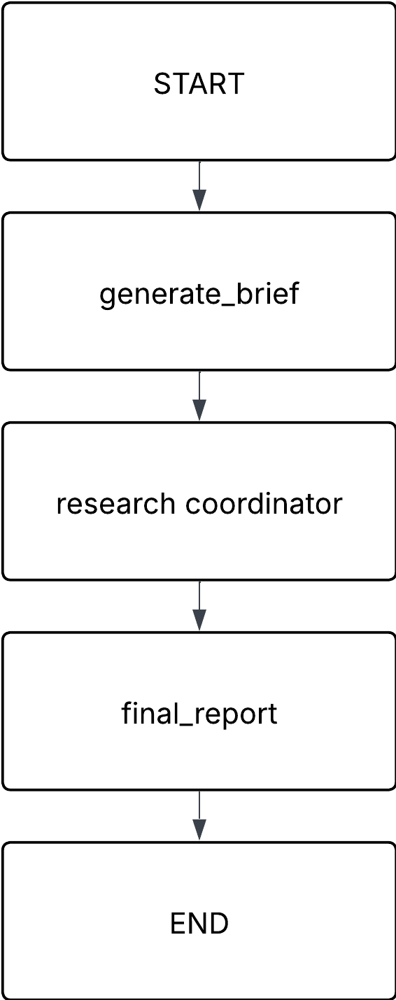
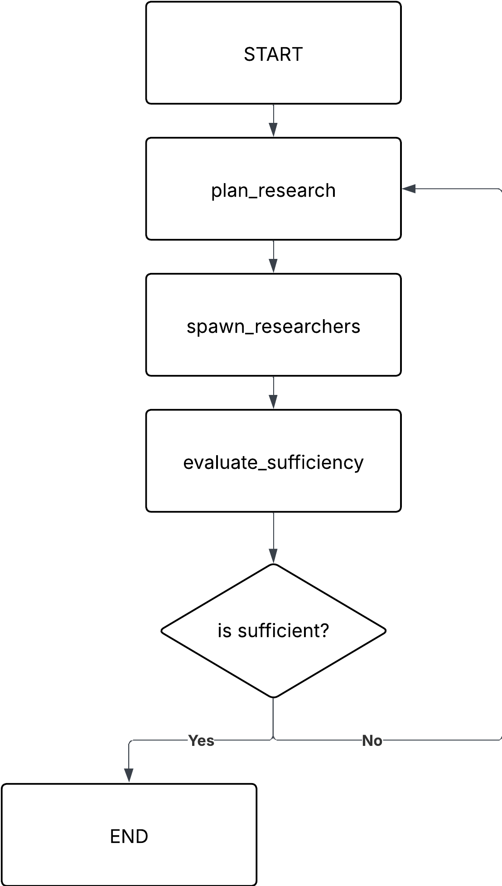
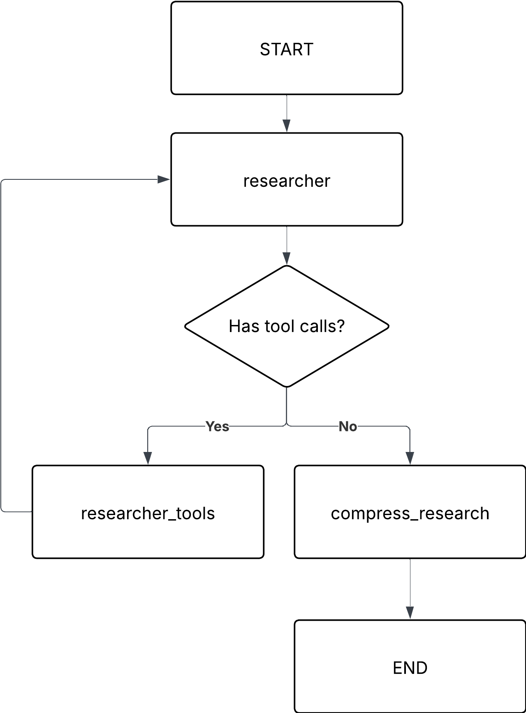

# Market Analysis Agent

An agentic market intelligence system for e-commerce. Given a product name or market query (e.g., "iPhone 16 Pro"), it autonomously researches the competitive landscape, pricing, customer sentiment, and market trends, then produces a comprehensive Markdown report with strategic recommendations and embedded charts.

## How It Works

1. **Brief Generation** -- An LLM converts your raw query into a structured research brief with product name, market category, target audience, and research questions.
2. **Research Planning & Execution** -- A coordinator agent decomposes the brief into research topics and spawns independent researcher agents. Each researcher runs a ReAct loop calling tools (web search, Amazon reviews, Google Trends) to collect data.
3. **Report Generation** -- A senior-analyst LLM synthesizes all research into a 2500-3000 word Markdown report covering executive summary, competitive landscape, pricing analysis, customer sentiment, market trends, and strategic recommendations.

## Prerequisites

- Python 3.13+
- [uv](https://docs.astral.sh/uv/) package manager
- Docker & Docker Compose (optional, for containerized usage)

## Setup

### 1. Clone the repository

```bash
git clone <repo-url>
cd market-analysis-agent-moov-ai
```

### 2. Create your environment file

```bash
cp .env.example .env
```

Edit `.env` and fill in your API keys:

```
ANTHROPIC_API_KEY=your-anthropic-key
TAVILY_API_KEY=your-tavily-key
SERPAPI_API_KEY=your-serpapi-key
```

| Variable | Required | Description |
|---|---|---|
| `ANTHROPIC_API_KEY` | **Yes** | API key for Anthropic Claude models (powers all LLM calls) |
| `TAVILY_API_KEY` | **Yes** | API key for Tavily web search |
| `SERPAPI_API_KEY` | No | API key for SerpAPI (Amazon reviews + Google Trends) |

> **Note on SerpAPI:** The `SERPAPI_API_KEY` is optional. However, without it the system falls back to mock services that only return cached data. This means the Amazon reviews and Google Trends sections of the report will be based on stale or placeholder data, which will significantly reduce the quality and accuracy of the final report.

### 3. Install dependencies

```bash
uv sync
```

## Running the Project

### Local

```bash
uvicorn app.main:app --host 0.0.0.0 --port 8000
```

The API will be available at `http://localhost:8000`.

### Docker

```bash
docker compose up --build
```

## Usage

### Health Check

```bash
curl http://localhost:8000/health
```

### Run a Market Analysis

```bash
curl -X POST http://localhost:8000/api/analyze \
  -H "Content-Type: application/json" \
  -d '{"query": "iPhone 16 Pro"}'
```

The response contains the research brief, individual research results, and the final Markdown report. Reports are also saved to the `reports/` directory with a UTC timestamp appended to the filename (e.g. `iphone_16_pro_20260323T142530Z.md`).

> **Note:** Example reports can be found in the `reports/` directory.

### Download a Report

Reports can be downloaded by name via:

```bash
curl -OJ http://localhost:8000/api/reports/iphone_16_pro_20260323T142530Z.md
```

`GET /api/reports/{filename}` returns the Markdown file as an attachment. The exact filename is included in the `/analyze` response and visible in the `reports/` directory.

> **Note:** Reports contain Mermaid charts. Not all Markdown viewers render Mermaid — [markdownviewer.pages.dev](https://markdownviewer.pages.dev/) is one that does.

## Cost

Running a single market analysis report can cost up to **~$1 USD** in API usage across Anthropic calls. Keep this in mind when running multiple analyses.

## Development

```bash
# Run tests
pytest

# Lint
ruff check .

# Type check
mypy .
```

## Project Structure

```
app/
├── main.py                  # FastAPI entry point
├── config.py                # Settings and model configuration
├── api/routes.py            # API endpoints
├── agent/                   # LangGraph agent orchestration
│   ├── analysis_pipeline.py # Top-level pipeline: brief -> research -> report
│   ├── coordinator.py       # Research coordinator: plan -> spawn -> evaluate
│   └── researcher.py        # Researcher subgraph: ReAct tool-calling loop
├── schemas/                 # Pydantic models
├── services/                # External API wrappers (SerpAPI, etc.)
├── tools/                   # LangChain tools (web search, reviews, trends)
└── utils/cache.py           # JSON file-based response cache
```


# Theoretical Answers (Steps 4-7)

---

## Overview

Three-layer LangGraph architecture:

1. **AnalysisPipeline**: converts a raw query into a structured research brief, delegates research, synthesizes the final report.
2. **ResearchCoordinator**: decomposes the brief into topics, spawns researcher agents, checks if findings are sufficient, loops back if not.
3. **ResearcherSubgraph**: each researcher runs a ReAct loop calling tools (web search, Amazon reviews, Google Trends) until it has enough data, then compresses findings into a summary.

## Diagrams

<table>
  <tr>
    <td align="center"><strong>Analysis Pipeline</strong></td>
    <td align="center"><strong>Coordinator</strong></td>
    <td align="center"><strong>Researcher</strong></td>
  </tr>
  <tr>
    <td></td>
    <td></td>
    <td></td>
  </tr>
</table>


---

## Steps 1-3: Technical Decisions

### Why LangGraph

It's the framework I have hands-on experience with. CrewAI adds role-based abstraction I didn't need. Google ADK is tightly coupled to Google's ecosystem. Going pure native Python would mean rebuilding state management, tool dispatch, conditional routing, and retry logic from scratch. Time was better spent on the actual pipeline.

### Why deep research

Mostly for fun. Inspired by Anthropic's post on [how they built a multi-agent research system](https://www.anthropic.com/engineering/built-multi-agent-research-system) I'd read a couple weeks ago: a coordinator that plans topics, spawns researchers, evaluates sufficiency, and loops back if gaps remain.

### Agents instead of tools

The assessment mentions a web scraper, sentiment analyzer, market trend analyzer, and report generator. My implementation maps differently:

- **Web scraper → Tavily web search tool.** Functionally equivalent.
- **Sentiment & trend analyzers → researcher agents.** These are analytical tasks an LLM does natively. The coordinator decides what needs investigating and spins up researchers dynamically instead of hard-coding analyst roles.
- **Report generator → pipeline node.** Always the final step, not a decision point, so it doesn't belong as a tool.

### Abstractions

- API services (Amazon search, reviews, Google Trends) inherit from a shared `SerpapiService` base class. Adding a new data source = extend the base and define query params.
- Each service has an abstract base with a real and mock implementation. A factory function checks if the API key exists and returns the right one.
- `fetch_reviews` uses a **strategy pattern**: iterates through review-fetching strategies (Amazon, web search fallback). Adding a new source = new strategy class, append to list, tool doesn't change.

---

## Step 4: Data Architecture & Storage

I'd use **Postgres** for structured data and **Redis** for caching.

Core tables:

- `analyses`: stores each run. Query, status, the generated brief (jsonb), final report markdown, metadata like token counts and duration, timestamps.
- `research_results`: FK to analyses, stores each researcher's topic and findings as jsonb.
- `price_snapshots`: product name, source, price, timestamp. Index on `(product_name, captured_at)` for fast range queries and historical comparison.

For **report versioning**, each run just creates a new row in `analyses`. Query by product name ordered by date to compare versions.

For **caching**, Redis with TTL-based keys for search results, review data, and trends. Avoids redundant API calls when the same product gets analyzed repeatedly in a short window.

---

## Step 5: Monitoring & Observability

### Tracing

**LangSmith** since the system already uses LangGraph. It captures the full execution graph per run: every node, tool call, and LLM invocation. Each analysis gets a trace ID that propagates through all three layers, so you can debug any run from a single link. An alternative if not using LangGraph could be something like OpenTelemetry.

### Metrics

Prometheus `/metrics` endpoint (visualize with Grafana). Key things to track:

- End-to-end analysis duration
- LLM call latency per node
- Token usage (input/output) for cost tracking
- Tool call error rates
- Number of researcher ReAct iterations
- How often the coordinator replans
- Current active/queued analyses

### Alerting

Grafana alerts to Slack or similar. Alert on latency spikes, elevated tool error rates, queue depth growing, or LLM provider degradation.

### Output quality

Run an LLM-as-judge evaluation on a sample of reports (see Step 7), track scores as a time series, alert if the average drops.

---

## Step 6: Scaling & Optimization

### Handling load spikes

- For a simple setup: a task queue. The `/analyze` endpoint enqueues a job and returns an ID immediately. Workers pull jobs off the queue.
- For something more resilient without managing infrastructure: durable functions (like Azure Durable Functions) handle orchestration, retries, and scaling automatically.
- For a more complex system with many services: a microservices architecture on Kubernetes with auto-scaling policies.

### LLM cost optimization

- Use cheaper/faster models for simple tasks (brief generation, summary compression). Save the expensive model for final report synthesis.
- Cache LLM responses for identical prompts.
- Cap researcher iteration loops.
- Context engineering: trim tool results before passing them to the LLM. Strip boilerplate, HTML noise, and metadata, keep only the parts that are actually relevant to the research question. Shorter context = fewer tokens = lower cost.

### Caching

Two layers:

1. **Tool-level (Redis, short TTL):** cache raw API responses. Same search query within an hour hits cache instead of calling the API again.
2. **Report-level (Postgres):** if someone requests an analysis for a query completed recently, return the existing report.

---

## Step 7: Continuous Improvement & A/B Testing

### LLM-as-judge

Define a rubric (accuracy, completeness, actionability, writing quality, each with a score 1-5). After each analysis, send the report + raw research to a judge LLM. Store scores alongside the analysis. Monitor trends over time.

### Comparing prompt strategies

Version all prompts. For incoming analyses, randomly assign a prompt version and tag the results. After enough samples, compare average judge scores. Winner becomes the default.

### User feedback loop

Thumbs up/down on delivered reports, optional free-text comment. Compare user ratings against judge scores. Periodically review low-rated reports, find patterns, update prompts.

### Evolving capabilities

- New tools: strategy pattern and base classes make this straightforward.
- New models and prompts: A/B split same prompt with different models and prompts, compare judge scores.