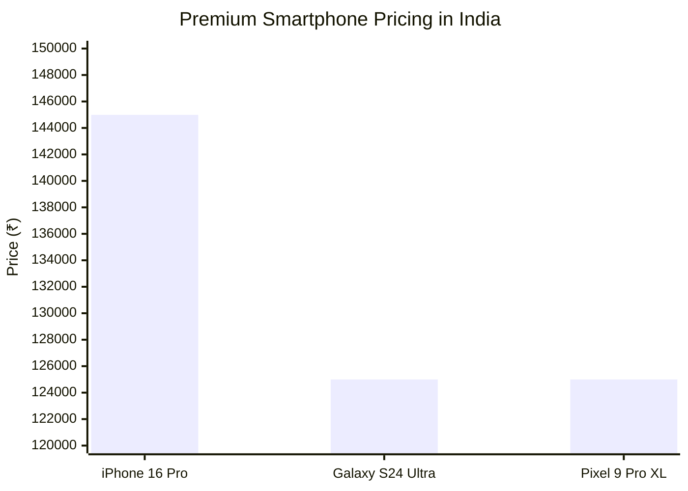
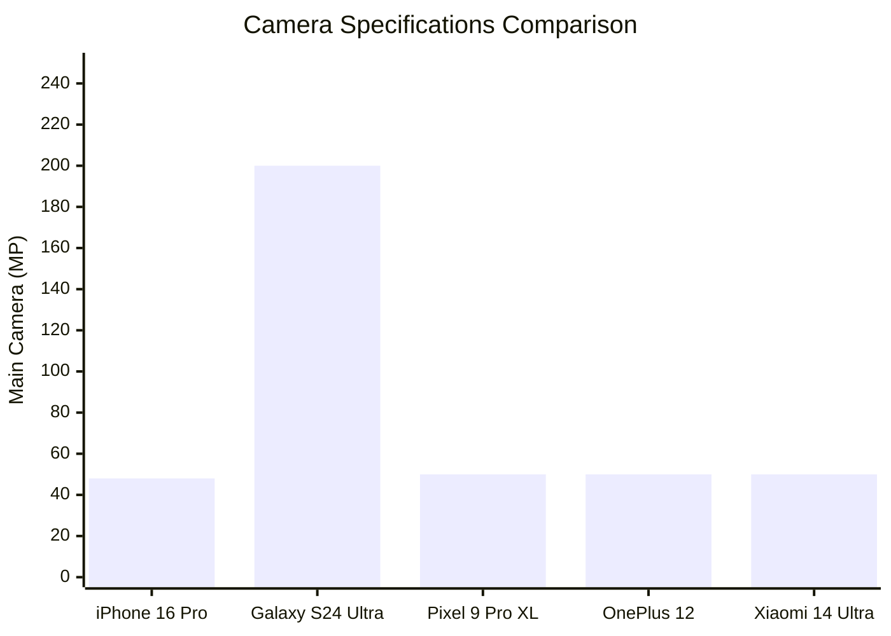
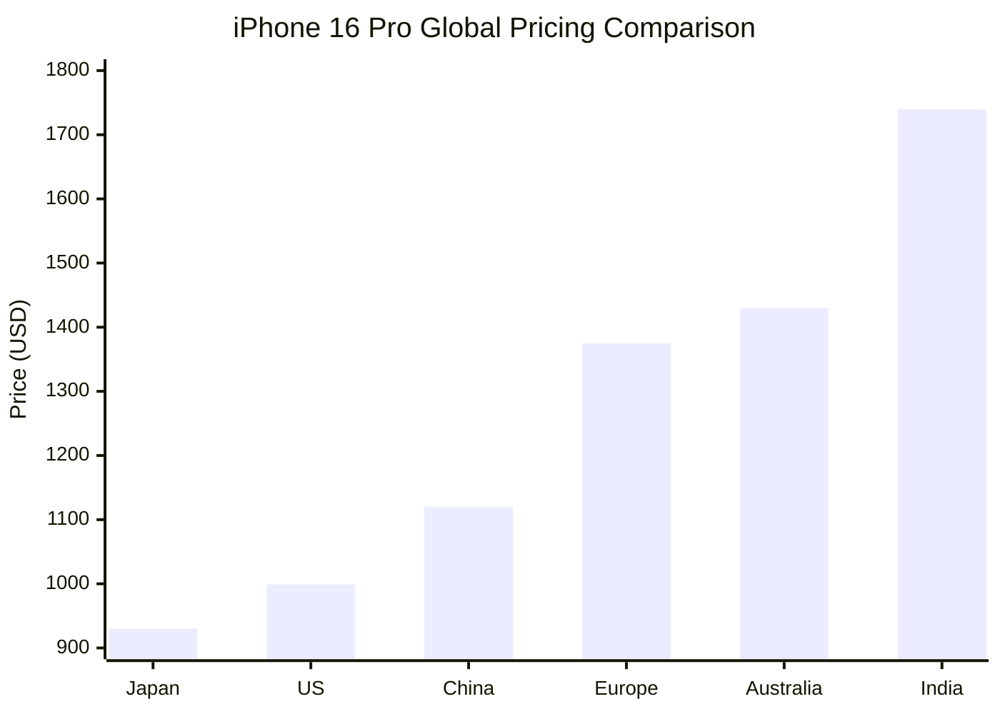
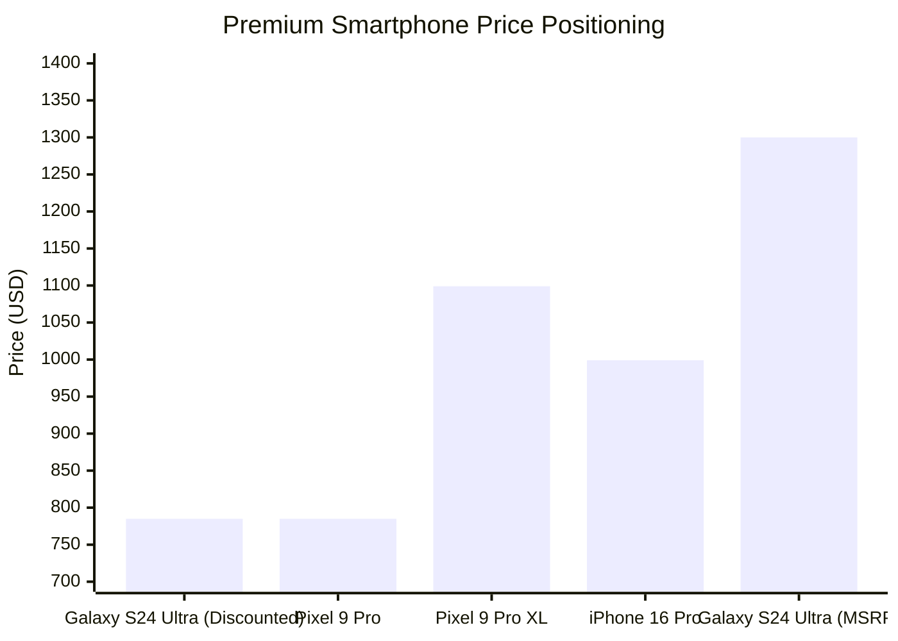
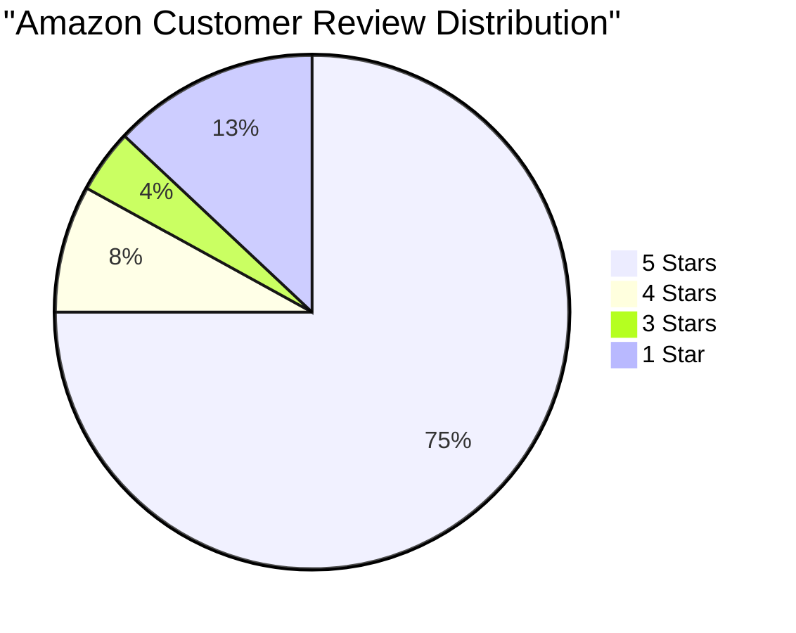
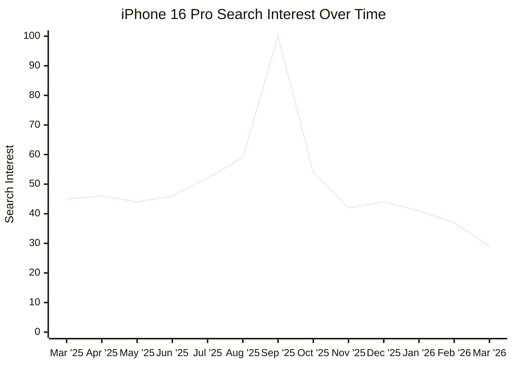
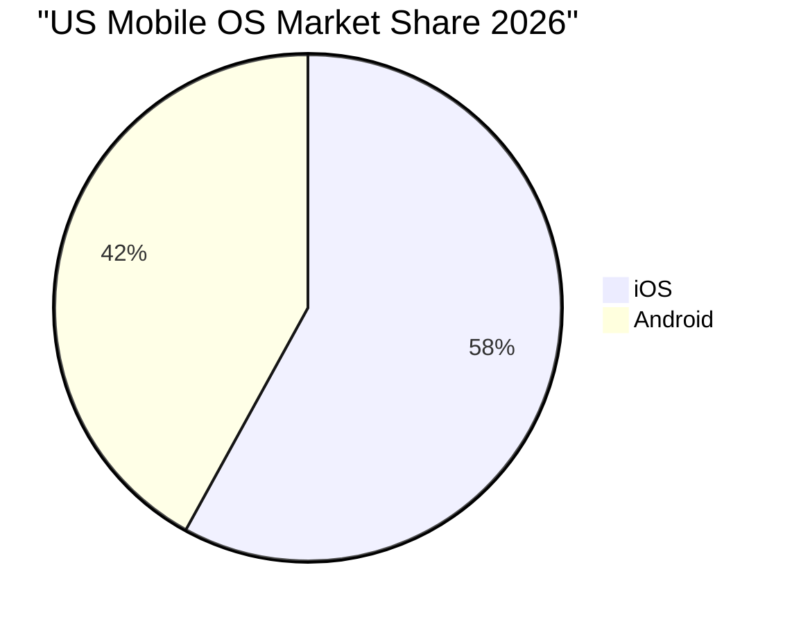

# Market Analysis: iPhone 16 Pro

## Executive Summary

The iPhone 16 Pro occupies a complex position in the premium smartphone market, commanding the highest price point at $999-$1,740 globally while facing intensifying competition and shifting consumer priorities. Despite maintaining Apple's position as the world's largest smartphone vendor with 240.6 million iPhone shipments in 2025, the iPhone 16 Pro shows concerning trends in market share erosion within Apple's own lineup, dropping from 45% to 38% of US iPhone sales compared to its predecessor.

The device delivers solid technical improvements including the A18 Pro chip, Camera Control button, and refined titanium construction, but customer sentiment reveals disappointment with Apple Intelligence features described as "rudimentary" and "underwhelming." With 63% of Americans avoiding phone upgrades due to inflation concerns and search interest declining to just 29% of peak levels by March 2026, the iPhone 16 Pro faces headwinds from both economic pressures and consumer preference shifts toward more affordable base models. The premium smartphone market is showing clear signs of maturation, with mid-range alternatives now delivering 80-90% of flagship functionality at significantly lower price points.

## Competitive Landscape

The premium smartphone segment is characterized by five distinct competitive strategies, each targeting different user priorities and price sensitivities. Apple's iPhone 16 Pro positions itself at the premium apex, leveraging ecosystem integration, the exclusive A18 Pro chip, and Apple Intelligence features to justify its $999-$1,740 global pricing range.

Samsung's Galaxy S24 Ultra emerges as the primary Android competitor, differentiating through productivity features including the integrated S Pen, industry-leading 2,600 nits peak brightness display, and exceptional software longevity with seven years of OS upgrades. The device's 200MP main camera sensor and 232-gram weight reflect Samsung's focus on maximum capability over portability.

Google's Pixel 9 Pro series leverages computational photography and AI integration through the Tensor G4 chip, featuring the highest resolution front camera at 42MP. The Pixel strategy focuses on software-driven camera improvements and pure Android experience, positioning at the same ₹1,24,999 price point as Samsung in key markets.

Chinese manufacturers OnePlus and Xiaomi compete primarily on hardware specifications and charging capabilities. Xiaomi's 14 Ultra features the largest 1-inch main camera sensor and 80W wireless charging, while OnePlus emphasizes 100W wired charging speeds. These brands typically offer superior price-to-performance ratios but lack the ecosystem integration of Apple or the enterprise features of Samsung.

The competitive landscape reveals clear market segmentation: Apple dominates premium ecosystem integration, Samsung leads in productivity and display technology, Google focuses on AI-driven photography, while Chinese brands compete on raw specifications and charging speeds.

## Pricing Analysis

The iPhone 16 Pro demonstrates significant pricing disparities across global markets, reflecting varying economic conditions, import duties, and local market dynamics. The device's $999 US base price escalates dramatically in international markets, with India representing the most expensive market at $1,740 - a 74% premium over US pricing.

Japan offers the most favorable pricing at $930, representing a $69 discount from US levels, while European markets command €1,449 ($1,375). These variations create opportunities for gray market imports and highlight the challenges of global pricing strategies in premium segments.

Competitive pricing analysis reveals strategic positioning challenges. Samsung's Galaxy S24 Ultra, originally priced at $1,300, is now available for $785 through promotional channels, creating a significant value gap. Google's Pixel 9 Pro XL at $1,099 positions directly between the iPhone 16 Pro and Pro Max models, offering compelling alternatives for price-conscious premium buyers.

US carrier promotions significantly impact effective pricing, with Verizon, AT&T, and T-Mobile offering the iPhone 16 Pro essentially free through trade-in programs providing up to $1,000 credit. This promotional pricing strategy helps maintain market share despite premium positioning but may pressure long-term profitability margins.

## Customer Sentiment

Customer reception of the iPhone 16 Pro reveals a nuanced satisfaction profile characterized by appreciation for build quality and performance improvements, tempered by disappointment over limited innovation and AI capabilities. Amazon reviews for refurbished units show predominantly positive ratings with 18 five-star reviews versus only 6 negative reviews, indicating strong overall satisfaction among actual users.

Professional and user feedback consistently praises specific hardware improvements. The Camera Control button receives universal acclaim as an "intuitive and practical addition," while the A18 Pro chip delivers solid gaming and multitasking performance. The titanium construction and refined design aesthetics continue Apple's reputation for premium build quality, with battery health reports ranging from 92-100% in customer reviews.

However, significant criticism centers on Apple Intelligence, consistently described as "rudimentary," "underwhelming," and "unfinished" at launch. Many users report that AI features don't justify upgrade costs, with functionality being limited compared to marketing promises. The camera system, while technically competent, is described as "largely unchanged" from the iPhone 15 Pro with only "minor updates," disappointing users expecting substantial improvements.

Battery performance shows mixed reception, with the iPhone 16 Pro delivering an average of 5 hours 54 minutes of screen-on time. While generally acceptable for long-term users, some customers report inconsistencies and software bugs affecting overall reliability. Common refurbished unit issues include missing accessories and occasional misrepresentation of dual-SIM capabilities, though these don't significantly impact overall satisfaction ratings.

The sentiment data suggests strong satisfaction among users upgrading from devices 3+ years old, but mixed reactions from recent iPhone owners due to incremental improvements. This pattern indicates the iPhone 16 Pro succeeds in retaining long-term customers but struggles to justify frequent upgrade cycles.

## Market Trends

The premium smartphone market in 2026 exhibits clear maturation signals and evolving consumer behavior patterns. Search interest data reveals the iPhone 16 Pro's declining mindshare, peaking at launch in September 2025 but falling to just 29% of peak interest by March 2026. This rapid decline indicates accelerating consumer attention shifts toward next-generation devices, with iPhone 17 Pro comparison searches increasing 2,800%.

Global smartphone market dynamics reflect broader industry challenges, with growth slowing to just 2% in 2025 despite reaching 1.25 billion units. Apple maintained its leadership position with 240.6 million iPhone shipments (+7% growth), but the overall market faces headwinds from slowing innovation cycles and rising prices. The anticipated entry of Apple's foldable iPhone in 2026 is expected to drive 20% growth in the foldable segment, potentially reshaping competitive dynamics.

Platform competition remains geographically divided, with Android dominating globally at 68-73% market share while iOS leads in premium US markets with 58% share. Critically, iOS users generate 3.5x higher in-app spending than Android users, making them more valuable despite smaller global numbers and reinforcing iOS's position in premium segments.

Consumer upgrade patterns reveal increasing value consciousness, with 36% of iPhone buyers in 2024 having owned their previous device for two years or less, up from 31% in 2023. However, the iPhone 15 Pro is increasingly positioned as a better value option compared to the iPhone 16 Pro, suggesting consumers prioritize pricing over incremental feature improvements. This trend indicates the premium smartphone market is reaching saturation in terms of meaningful innovation that justifies premium pricing.

The market shows clear bifurcation between ultra-premium segments (phones >$800) representing 20% of global shipments with strong growth, and budget-conscious consumers driving base model sales. Apple's response with 5-15% price reductions on iPhone 16 Pro models acknowledges that premium pricing may have overshot consumer willingness to pay in the current economic environment.

## Strategic Recommendations

**1. Accelerate Apple Intelligence Development and Marketing Realignment**
The research clearly indicates Apple Intelligence features are the primary disappointment for iPhone 16 Pro users, consistently described as "rudimentary" and "unfinished." Apple should prioritize substantial AI capability improvements in the next software update cycle and realign marketing messaging to set more realistic expectations. Consider partnering with leading AI companies or acquiring specialized AI talent to accelerate development timelines.

**2. Implement Dynamic Global Pricing Strategy**
With pricing variations of up to $741 between markets and strong promotional success in carrier channels, Apple should develop more sophisticated regional pricing strategies. The successful $10,000 price reduction in India demonstrates market responsiveness can drive adoption. Consider implementing seasonal pricing adjustments and expanding trade-in programs globally to improve value perception without permanently reducing premium positioning.

**3. Differentiate Pro Models Through Exclusive Professional Features**
The iPhone 16 Pro's market share erosion within Apple's lineup (45% to 38%) indicates insufficient differentiation from base models. Focus development resources on professional-grade features that justify the premium: advanced video editing capabilities, enhanced thermal management for sustained performance, and exclusive productivity tools that appeal to business users. The research shows thermal improvements are desired by 26.8% of users - this represents a clear development priority.

**4. Strengthen Mid-Range Defense Strategy**
With mid-range alternatives delivering 80-90% of flagship functionality at $400-700 lower prices, Apple faces increasing pressure from capable alternatives like the OnePlus 12R and Pixel 8a. Consider developing a "Pro Lite" model positioned between the base iPhone and Pro models, or enhance the base iPhone with select Pro features to maintain ecosystem capture while addressing price sensitivity.

**5. Optimize Product Launch Timing and Lifecycle Management**
The rapid decline in search interest (100 to 29 in six months) and early consumer focus on iPhone 17 Pro comparisons suggest current product cycles may be too long for maintaining market attention. Consider implementing more frequent feature updates through software releases, or adjust hardware refresh cycles to maintain consumer engagement. Additionally, leverage the strong satisfaction ratings from users upgrading from 3+ year old devices by targeting marketing toward this segment rather than annual upgraders.