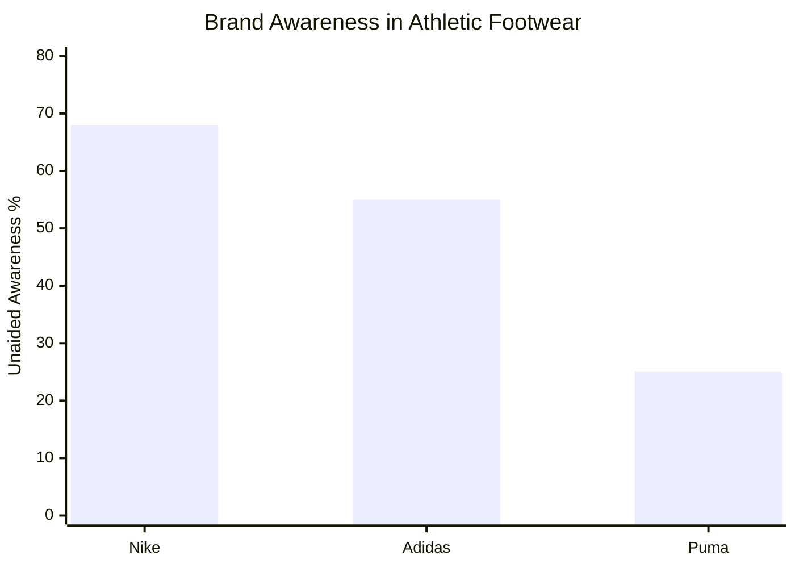
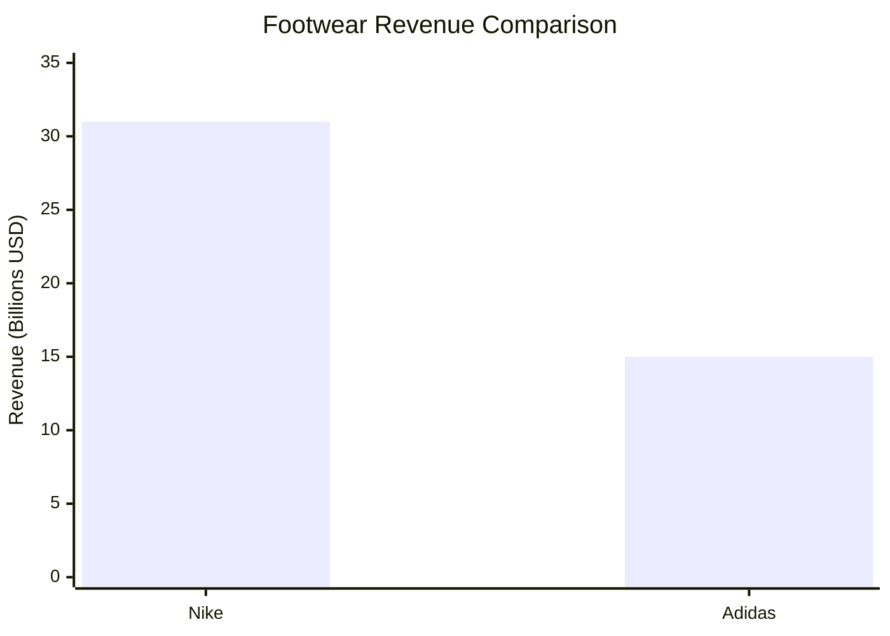
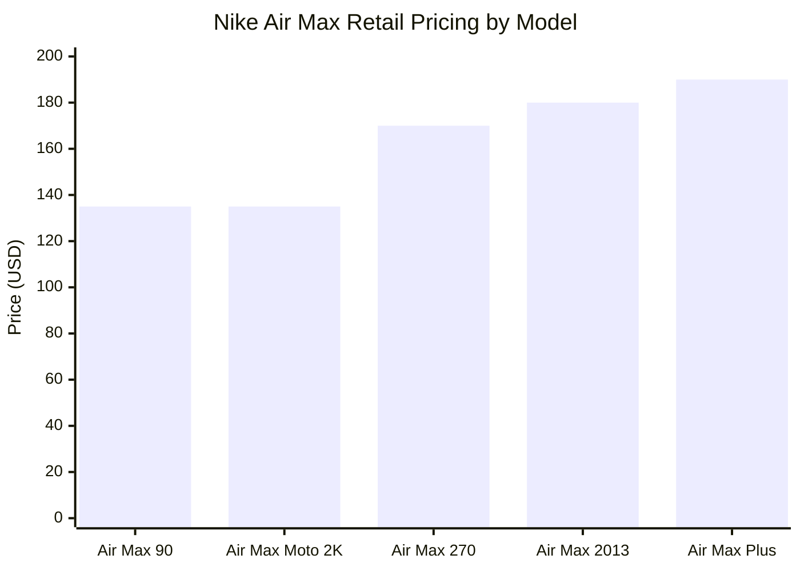
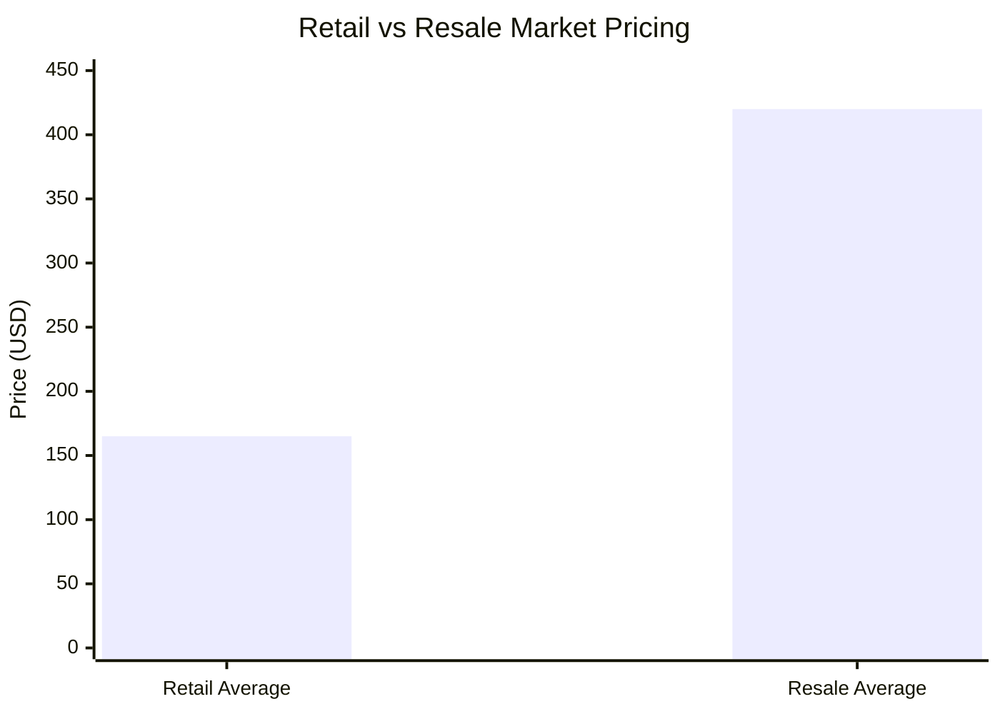
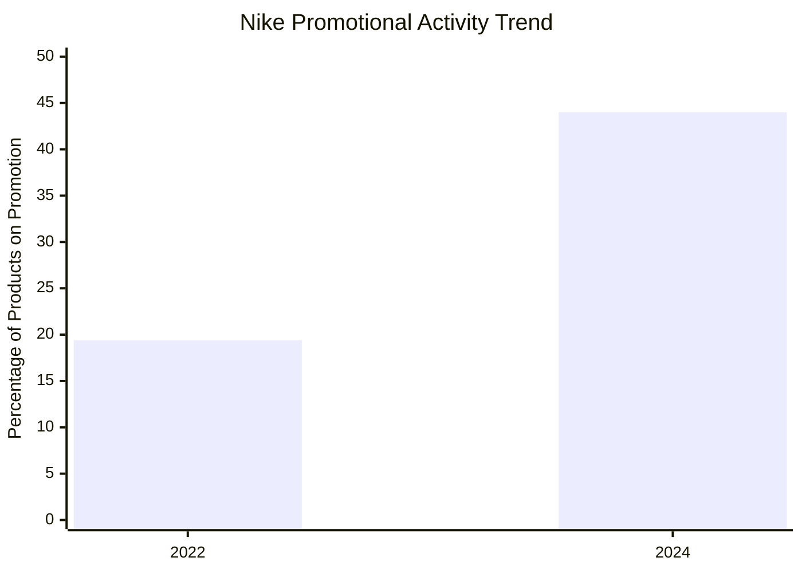
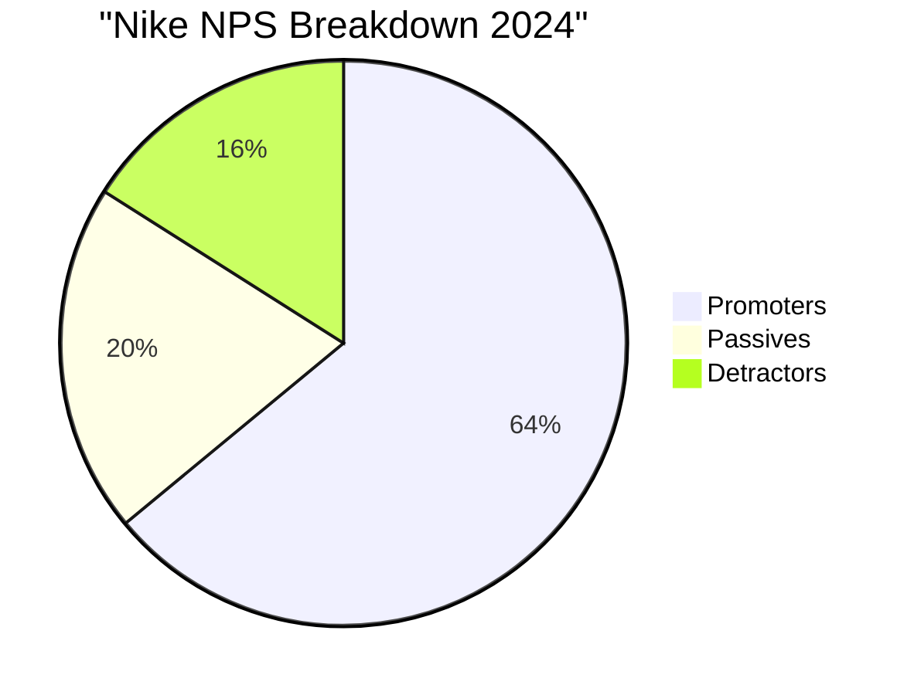
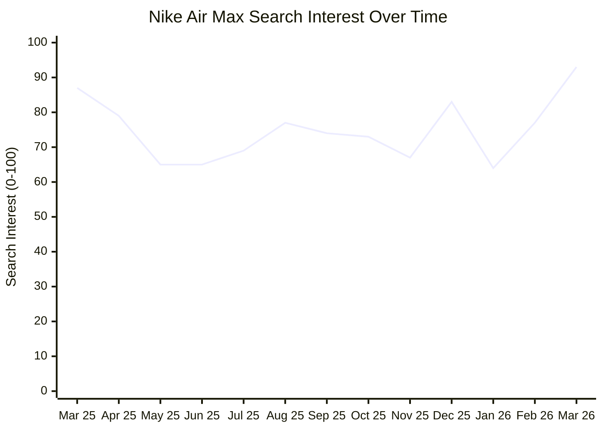
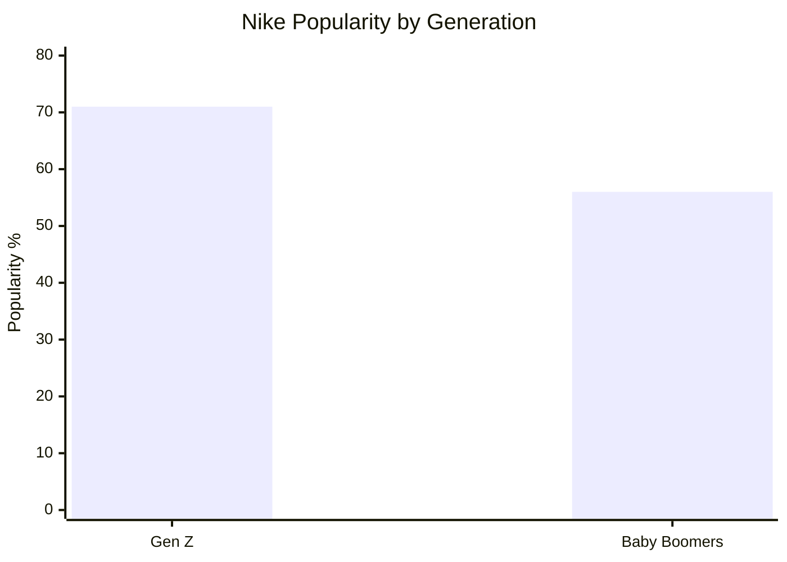

# Market Analysis: Nike Air Max

## Executive Summary

Nike Air Max maintains a commanding position in the premium athletic footwear market, leveraging the brand's dominant 68% unaided awareness and $31 billion footwear revenue to drive consistent demand. The Air Max line demonstrates strong seasonal patterns with peak interest in March (93) and holiday periods, while maintaining pricing power across retail channels at $135-$190 MSRP. However, the brand faces significant challenges with sizing inconsistency and quality control issues that impact customer satisfaction despite a solid Net Promoter Score of 48.

The resale market reveals extraordinary demand dynamics, with Air Max models commanding 197% premiums over retail prices on platforms like StockX and GOAT. This secondary market strength, combined with Nike's strategic focus on sustainability (78% of products now contain recycled materials) and strong Gen Z appeal (71% popularity), positions the brand well for continued growth in the projected $17.2 billion US athletic footwear market by 2028. Strategic improvements in sizing consistency and quality control could unlock significant additional value from Nike's loyal customer base.

## Competitive Landscape

Nike dominates the premium athletic footwear segment with nearly double the revenue of its closest competitor. The competitive hierarchy shows clear market positioning, with Adidas securing second place through successful collaborations and cultural relevance initiatives, while Puma maintains third position with emerging brands like New Balance and Asics gaining momentum as "rising stars."

The revenue gap between Nike and competitors is substantial, with Nike generating $31 billion compared to Adidas's $15 billion in footwear revenue. This market dominance translates into significant competitive advantages including supply chain leverage, marketing reach, and retail partnership strength.

Key differentiators in the competitive landscape include Nike's Air cushioning technology, Adidas's Boost foam innovation in models like Ultraboost, and emerging competitors focusing on heritage craftsmanship (New Balance's "Made in USA" positioning) and specialized performance features. The market shows increasing emphasis on cultural collaborations, with hip-hop artist partnerships and limited edition releases driving brand differentiation and premium pricing power.

## Pricing Analysis

Nike Air Max pricing demonstrates sophisticated channel management with consistent retail pricing but dramatic resale market premiums. Retail channels maintain standardized pricing across major partners, with models ranging from the entry-level Air Max 90 at $135 to premium offerings like the Air Max Plus at $190.

The resale market reveals extraordinary demand dynamics, with average prices reaching $420 compared to retail averages of $165 - representing a 197% premium. This secondary market strength indicates significant unmet demand at retail prices and validates Nike's premium positioning strategy.

Promotional activity has increased significantly, with retailers discounting 44% of Nike sneakers in 2024 compared to just 19.4% in 2022. This trend suggests intensifying retail competition and potential margin pressure, though the strong resale market indicates underlying demand remains robust.

## Customer Sentiment

Nike Air Max maintains solid customer loyalty with a Net Promoter Score of 48, placing it within industry averages for consumer electronics (47.5) but below top-quartile performers (65+). The sentiment breakdown shows 64% promoters, 20% passives, and 16% detractors, indicating strong brand advocacy despite persistent product issues.

The most significant pain point across customer feedback is sizing inconsistency, with frequent reports that Air Max models "run small" and recommendations to "order at least half size bigger." This sizing issue extends beyond inconvenience to physical discomfort, with customers reporting foot pain after just 2 hours of wear, ankle bruising, and specific side foot pain in models like the Air Max 90.

Quality control represents another major concern, with isolated but impactful reports of product failures including shoes "splitting from 1 wear." Despite these issues, customers consistently praise Nike Air Max for nostalgic design appeal, effective cushioning when properly fitted, and lightweight construction. The persistence of customer loyalty despite known issues suggests strong brand equity, but addressing these concerns could significantly improve satisfaction scores and reduce negative feedback across review platforms.

## Market Trends

Nike Air Max demonstrates clear seasonal demand patterns with strong peaks during spring launch periods and holiday shopping seasons. Search interest data reveals March as the strongest month (93), followed by December holiday shopping (83), with summer months showing lower engagement in the mid-60s range.

Generational preferences show Nike's particular strength among younger demographics, with 71% popularity among Gen Z compared to 56% among Baby Boomers. This 15-percentage-point advantage among the key growth demographic positions Nike well for future market expansion as Gen Z reaches peak earning years.

Sustainability has emerged as a critical market driver, with Nike reporting 78% of products now containing recycled materials and targeting 100% waste diversion by 2025. Limited edition sustainable collaborations demonstrate market appetite for environmentally conscious products, while the Air Max 90 maintains its position as the clear market leader with an 8.94/10 popularity score.

Current trends indicate growing influence from Gorpcore aesthetics and comfort-focused innovations, with newer models like the Air Max DN8 receiving positive consumer reviews at $190 price points. Women's specific models show particularly strong growth trajectories, and e-commerce demand remains robust with platforms like Zalando showing +1,950% growth as a related search topic.

## Strategic Recommendations

**1. Address Sizing Inconsistency Immediately**
Implement comprehensive sizing standardization across all Air Max models to eliminate the persistent "runs small" feedback. This single improvement could significantly reduce returns, improve customer satisfaction scores, and decrease negative reviews. Consider developing a sizing guide specific to Air Max technology and foot shape variations.

**2. Leverage Resale Market Dynamics for Direct Revenue**
The 197% resale premium indicates significant unmet demand at retail prices. Consider implementing limited direct-to-consumer drops at premium pricing ($250-$300) for exclusive colorways or collaborations, capturing value currently flowing to resale platforms while maintaining scarcity appeal.

**3. Accelerate Sustainability Marketing**
With 78% of products containing recycled materials and strong consumer demand for eco-friendly options, develop a comprehensive sustainability communication strategy. Create dedicated sustainable Air Max lines with premium pricing to capture environmentally conscious consumers willing to pay more for responsible products.

**4. Optimize Seasonal Inventory and Marketing**
Align production and marketing spend with the clear seasonal patterns showing March and December peaks. Increase inventory allocation for spring launches and holiday periods while reducing summer production to improve margin efficiency and reduce promotional pressure.

**5. Strengthen Gen Z Engagement Through Digital Channels**
With 71% popularity among Gen Z versus 56% among Baby Boomers, invest heavily in TikTok, Instagram, and emerging social platforms. Develop Gen Z-specific colorways, collaborations with young artists and influencers, and digital-first launch strategies to maintain this demographic advantage as they enter peak earning years.