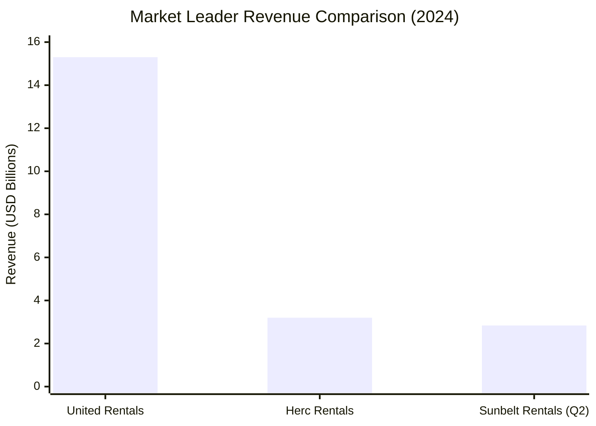
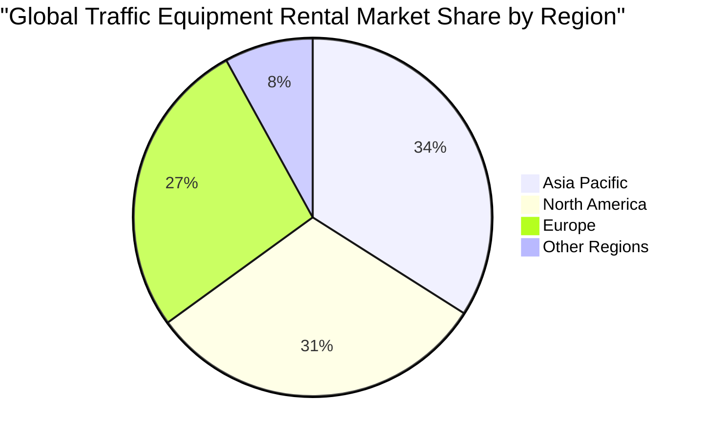
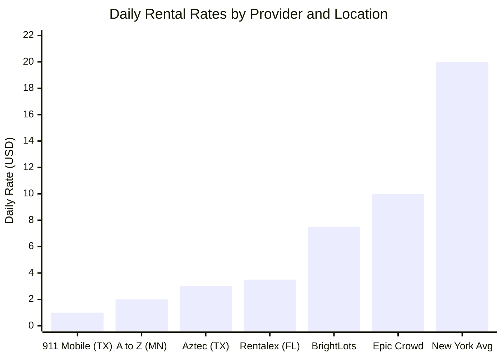
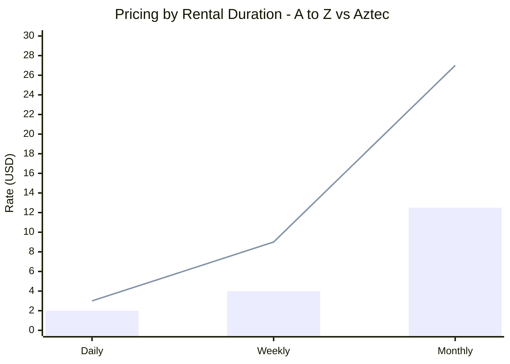
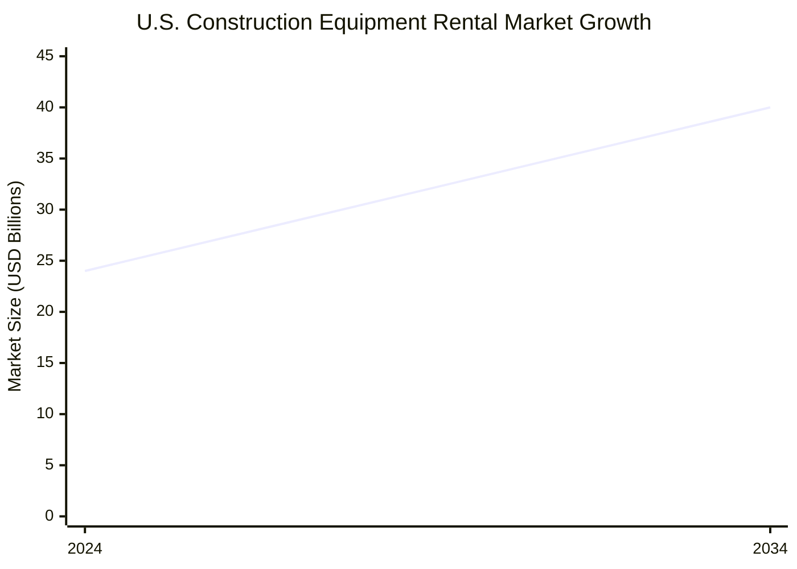
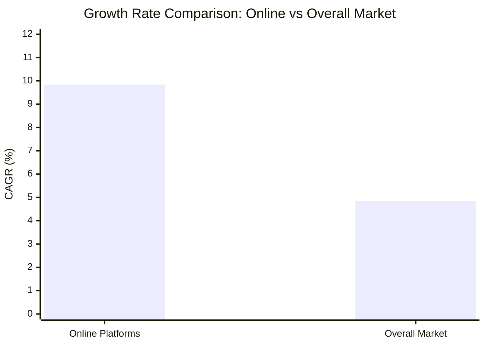

# Market Analysis: Orange Construction Cone Rental

## Executive Summary

The orange construction cone rental market represents a specialized segment within the broader $148.6 billion global construction equipment rental industry, which is experiencing robust growth at a 5.6-6.1% CAGR through 2032. The market is characterized by a two-tier competitive structure where national giants like United Rentals ($15.3 billion revenue) dominate through extensive geographic coverage, while regional specialists compete on traffic control expertise and superior local service.

Pricing varies dramatically across markets, with daily rates ranging from $1.00 in Texas to $20.00 in New York, reflecting significant regional disparities and diverse pricing models. Customer satisfaction is generally positive, driven by quick delivery times and competitive pricing, though product durability and service consistency remain pain points. The market shows strong seasonal patterns with peak demand during spring and summer construction months, while digital platform adoption is accelerating at a 9.84% CAGR, outpacing overall market growth and transforming customer engagement patterns.

## Competitive Landscape

The construction cone rental market operates within a highly consolidated competitive environment dominated by three major national players. United Rentals leads the market with $15.3 billion in revenue and over 1,500 locations nationwide, leveraging its position as the world's largest equipment rental firm. Sunbelt Rentals, owned by Ashtead Group, holds the second position with $2.84 billion in Q2 2024 revenue and comprehensive North American coverage. Herc Rentals rounds out the top three with approximately 4% market share and $3.2 billion in equipment rental revenue for 2024, demonstrating strong 11% year-over-year growth.

Beyond these national giants, the market features numerous regional specialists including Wright (WD Wright), Right Traffic, Capitol Barricade, Bird Dog Traffic Control, and AWP Safety. These companies differentiate themselves through specialized expertise in traffic management and localized customer service, competing effectively against the national chains in specific geographic markets.

The competitive structure reflects clear geographic segmentation, with Asia Pacific leading global traffic equipment rental market share at 34%, followed by North America at 31% and Europe at 27%. This distribution indicates significant growth opportunities in emerging markets while highlighting the maturity of North American and European markets.

## Pricing Analysis

The construction cone rental market exhibits significant pricing disparities across regions, rental durations, and equipment specifications. Daily rates demonstrate extreme variation, ranging from promotional rates as low as $1.00 per cone in Texas markets to premium pricing of $20.00 per day in New York, representing a 20-fold difference between markets.

Rental duration significantly impacts pricing structures, with longer-term rentals offering substantial economies of scale. A to Z Rental exemplifies this trend with $2.00 daily rates dropping to $4.00 weekly and $12.50 monthly for 12" cones. Similarly, Aztec Rental offers $3.00 daily, $9.00 weekly, and $27.00 monthly rates, while BrightLots employs tiered pricing at $7.50 daily for the first week, then $2.50 daily for extended rentals.

The market accommodates various pricing models including flat daily rates, tiered duration pricing, bulk package deals (such as $95 monthly for 12 cones), and promotional rates. Equipment specifications also influence pricing, with basic cones priced around $3.00, premium 28" models at $22.49, and specialty weighted/LED versions reaching $32.29. Additional features like LED lighting systems add $18.95 to base pricing.

## Customer Sentiment

Customer satisfaction in the construction cone rental market is generally positive, with key satisfaction drivers including quick delivery times, competitive pricing, and responsive customer service. Testimonials highlight exceptional service delivery, including 2-day delivery for large orders of 150 cones, demonstrating the industry's capability to meet urgent project requirements.

However, several pain points emerge from customer feedback that require attention. Product durability represents a significant concern, with customers reporting cones that "started to lean like they were melting" after just a few days in moderate temperatures (upper 70s). This suggests quality control issues that could impact customer retention and safety compliance.

Product availability challenges, including backorders, create customer frustration, though effective customer service can mitigate these issues through substitutions and compensatory discounts. Service quality appears inconsistent across providers, with some customers experiencing "poor customer service" despite the generally positive industry trend.

The typical rental cost range of $10-$50 appears acceptable to customers, who demonstrate willingness to pay premium prices for quality products and reliable service. Customers particularly value weather-resistant materials capable of withstanding extreme conditions, flexibility in returns and substitutions, and multiple return location options (such as Baltimore, D.C., and Northern Virginia coverage).

## Market Trends

The construction cone rental market is experiencing robust growth as part of the broader construction equipment rental industry expansion. The global market, valued at $99.76-$148.63 billion in 2024, is projected to reach $166.07-$237.96 billion by 2032-2035, representing a compound annual growth rate of 5.6-6.1%. The U.S. market specifically shows strong momentum, forecast to grow from $24 billion in 2024 to nearly $40 billion by 2034.

Several key growth drivers are reshaping market dynamics. The preference for cost-effective rental solutions over equipment ownership continues to strengthen due to high capital costs and project-specific requirements. Extensive infrastructure spending and urbanization projects, particularly in emerging markets, are driving sustained demand. Labor shortages, estimated at 439,000 additional workers needed in 2024, are pushing contractors toward rental subscriptions and digital solutions.

Digital transformation represents the most significant trend reshaping the industry. Construction equipment rental software market growth from $950 million in 2024 to a projected $1.8 billion by 2032 reflects accelerating technology adoption. Online platforms are experiencing exceptional growth at a 9.84% CAGR through 2031, significantly outpacing the overall market growth of 4.85%.

Seasonal demand patterns show consistent peaks during spring and summer months when construction activity is highest, with fall serving as a secondary peak for project completion and site preparation. Winter represents the lowest demand period due to reduced construction activity and weather constraints. The material handling segment demonstrates the strongest growth potential with a 5.5% CAGR from 2024-2032, while Asia-Pacific markets experience the most rapid expansion due to accelerated urbanization and industrialization efforts.

## Strategic Recommendations

Based on the comprehensive market analysis, five strategic recommendations emerge for decision-makers in the construction cone rental market:

**1. Implement Dynamic Regional Pricing Strategy**
The 20-fold pricing variation between markets (Texas $1.00 vs. New York $20.00) indicates significant opportunity for optimized pricing strategies. Develop region-specific pricing models that account for local market conditions, competition density, and demand patterns. Consider implementing fuel-indexed transportation surcharges similar to Sunbelt Rentals' model to maintain margin stability while remaining competitive.

**2. Invest in Digital Platform Capabilities**
With online platforms growing at 9.84% CAGR versus 4.85% overall market growth, digital transformation is essential for competitive advantage. Develop or enhance mobile applications with real-time inventory access, automated contract management, and fleet tracking capabilities. Implement IoT-enabled equipment tracking and cloud-based rental management systems to optimize fleet utilization and improve customer experience.

**3. Address Product Quality and Durability Issues**
Customer complaints about cones "melting" in moderate temperatures represent both a safety risk and customer retention threat. Invest in higher-quality materials and UV stabilization technology. Consider offering premium product tiers with enhanced durability features, potentially commanding higher rental rates while improving customer satisfaction and reducing replacement costs.

**4. Develop Seasonal Demand Management Programs**
Capitalize on clear seasonal patterns by implementing dynamic inventory management and pricing strategies. Develop winter storage and maintenance programs, offer off-season discounts to smooth demand curves, and create seasonal package deals for contractors planning multi-month projects. Consider geographic diversification to balance seasonal variations across different climate zones.

**5. Focus on Service Consistency and Delivery Excellence**
While customers generally report positive experiences, service inconsistency remains a pain point. Standardize delivery timeframes, implement customer satisfaction tracking systems (which show 30% higher retention rates), and develop comprehensive customer support programs. Given that customers prioritize delivery speed and reliability over price, investing in logistics capabilities and customer service training can create sustainable competitive advantages in this growing market.